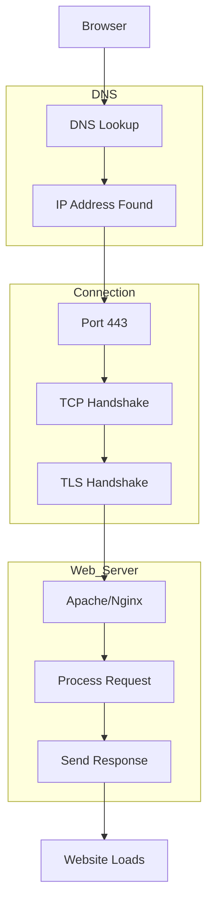

## In networking, there are 65,535 ports in total for both TCP and UDP protocols.

They are divided into 3 main ranges:

Port Range	Name	Purpose

0–1023	Well-Known Ports	Common services and protocols

1024–49151	Registered Ports	Applications/services

49152–65535	Dynamic/Private Ports	Temporary client-side ports

## Common Networking Ports

Here are the ports you’ll see most often in IT, cybersecurity, networking, and SOC work:

|Port | Protocol | Service |
|---|---|---|
|20 |	TCP |	FTP Data |
|21	| TCP	| FTP Control |
|22	| TCP	| SSH | 
|23	| TCP	| Telnet |
|25	| TCP	| SMTP |
|53	| TCP/UDP	| DNS | 
|67	| UDP	| DHCP Server |
|68	| UDP	| DHCP Client |
|69	| UDP	| TFTP |
|80	| TCP	| HTTP |
|88	| TCP/UDP	| Kerberos |
|110 | TCP | POP3 |
|119	| TCP	| NNTP | 
|123	| UDP	| NTP |
|135	| TCP	| Microsoft RPC |
|137	| UDP	| NetBIOS Name|
|138	| UDP	| NetBIOS Datagram |
|139	| TCP	| NetBIOS Session |
|143	| TCP	| IMAP | 
|161	| UDP	| SNMP |
|162	| UDP	| SNMP Trap |
|179	| TCP	| BGP |
|389	| TCP/UDP	| LDAP |
|443	| TCP	| HTTPS |
|445	| TCP	| SMB |
|465	| TCP	| SMTPS |
|514	| UDP	| Syslog |
|515	| TCP	| LPD Printing |
|587	| TCP	| SMTP Submission |
|636	| TCP	| LDAPS |
|989	| TCP	| FTPS Data |
|990	| TCP	| FTPS Control |
|993	| TCP |	IMAPS |
|995	| TCP	| POP3S |
|1433	| TCP |	Microsoft SQL Server |
|1521	| TCP	| Oracle DB |
|1701	| UDP | L2TP |
|1723	| TCP	| PPTP | 
|1812	| UDP |	RADIUS Authentication |
|1813	| UDP	| RADIUS Accounting |
|2049	| TCP/UDP |	NFS |
|3306	| TCP	| MySQL |
|3389	| TCP |	RDP | 
|5060	| TCP/UDP	| SIP |
|5061	| TCP	| SIP TLS |
|5432 | TCP |	PostgreSQL |
|5900	| TCP	VNC |
|5985	| TCP |	WinRM HTTP |
|5986	| TCP |	WinRM HTTPS |
|6379	| TCP |	Redis |
|8080	| TCP |	Alternate HTTP |
|8443	| TCP |	Alternate HTTPS |
|9200	| TCP	| Elasticsearch |
|27017 |	TCP |	MongoDB |

## Very Important Ports for Cybersecurity

If you're learning cybersecurity or SOC analysis, focus heavily on these:
```text
21 → FTP
22 → SSH
23 → Telnet
25 → SMTP
53 → DNS
80/443 → Web traffic
135–139 → Windows networking
445 → SMB
3389 → RDP
1433 → MSSQL
3306 → MySQL
5985/5986 → WinRM
```

Easy Way to Remember
```text
Web
80 = HTTP
443 = HTTPS
```
```text
Remote Access
22 = SSH
23 = Telnet
3389 = RDP
```
```text
File Transfer
20/21 = FTP
445 = SMB
```
```text
Email
25 = SMTP
110 = POP3
143 = IMAP
```
```text
Networking Infrastructure
53 = DNS
67/68 = DHCP
123 = NTP
```

### Quick Cybersecurity Tip

Attackers commonly target:

22 (SSH brute force)

3389 (RDP attacks)

445 (SMB exploits)

1433/3306 (database attacks)

That’s why these ports are often monitored in SIEMs and firewalls.

### A port is like a numbered door on a computer that allows different services to communicate over a network.

Your computer has:
```text
an IP address → the house address
ports → individual doors/rooms for services
```

Example:
```text
Port 80 = website traffic (HTTP)

Port 443 = secure websites (HTTPS)

Port 22 = SSH remote access
```
Example

When you open a website: https://google.com

Your browser connects to: Google IP : Port 443

Because HTTPS uses port 443.

Common Ports

|Port | Service|
|---|---|
|22 | SSH|
|80 | HTTP|
|443 |	HTTPS|
|445 | SMB|
|3389 | RDP|

### Why Ports Matter in Cybersecurity

Attackers scan ports to find running services:

Open port 22 → SSH available

Open port 3389 → RDP available

### Tools like:

Nmap & Wireshark are used to analyze ports and traffic.

## Apache

Apache HTTP Server (usually just called “Apache”) is a web server software.

It serves websites to users over the internet.

Simple Explanation

When someone visits a website:

Browser sends request

Apache receives it

Apache sends back the webpage files

Example Flow

User Browser → Apache Server → Website Opens

Apache Usually Uses

80	- HTTP

443 - HTTPS

## Why Apache Is Important

Many websites run on Apache:

company websites,
blogs,
web applications

In Cybersecurity

Apache logs are useful for:
```text
detecting attacks
suspicious requests
brute force attempts
web exploitation
```

Common log locations on Linux:
```text
/var/log/apache2/
/var/log/httpd/
```

## Payload

A payload is the actual code or data delivered during an attack or exploit.

Think of it like: the “main action” after the attack succeeds.

Example An attacker exploits a vulnerability:

Exploit → Payload Executes

The exploit opens the door.

The payload does the job.

Types of Payloads

|Payload Type | Purpose|
|---|---|
|Reverse shell	| Gives attacker remote access|
|Meterpreter	| Advanced control session|
|Ransomware payload |	Encrypts files|
|Downloader payload |	Downloads malware|
|Keylogger payload	| Records keystrokes|

Example in Ethical Hacking Labs

Using Metasploit Framework:
```text
**msfvenom -p windows/meterpreter/reverse_tcp windows/meterpreter/reverse_tcp = payload type**
```

### Important Difference

|Term | Meaning|
|---|---|
|Exploit	| Uses vulnerability|
|Port	| Door number|
|Apache	| Receptionist/web server|
|Payload | Package delivered inside|

## Protocols (Networking)

A protocol is a set of rules that devices follow to communicate over a network or the internet.

Think of it like:

Humans use languages (English, French)

Computers use protocols

Without protocols, computers would not understand each other.

Simple Analogy

| Networking Term	| Real Life Example |
|---|---|
| IP Address | House address | 
| Port	| Door number |
| Protocol | Language/rules used | 
| Apache	| Receptionist |
| Payload | Package/content |

## Common Networking Protocols  

## HTTP
```text
HyperText Transfer Protocol

Used for websites.

Default port: 80

Example: http://example.com

Data is NOT encrypted.
```

## HTTPS
```text
HTTP Secure

Secure/encrypted version of HTTP.

Default port: 443

Example: https://google.com

Uses SSL/TLS encryption.
```

## TCP
```text
Transmission Control Protocol

Reliable communication protocol.

Makes sure: packets arrive, data is correct, nothing is missing

Used For

websites

logins

file transfers

Example: When downloading a file:

TCP checks all pieces arrive correctly
```
## UDP
```text
User Datagram Protocol

Faster but less reliable than TCP.

No checking if packets arrive.

Used For

gaming

streaming

voice/video calls

Example: Google Meet audio/video often uses UDP because speed matters more than perfection.
```

## TCP vs UDP

| Feature |	TCP |	UDP |
|---|---|---|
| Reliable | Yes | No |
| Faster | No	| Yes |
| Error Checking | Yes | Minimal |
| Used For | Web, files	| Streaming, games |

## - DNS
```text
Domain Name System

Converts website names into IP addresses.

Example: google.com → 142.x.x.x

Port: 53

Uses both TCP and UDP.
```

## - DHCP
```text
Dynamic Host Configuration Protocol

Automatically gives devices:

IP address

Ports: 67/68
```
## FTP
```text
File Transfer Protocol

Transfers files between systems.

Ports: 20/21

Not secure by default.
```

## SSH
```text
Secure Shell

Secure remote access to another computer.

Port: 22

Admins use SSH to manage Linux servers remotely.
```

## SMTP
```text
Simple Mail Transfer Protocol

Sends emails.

Port: 25
```

## IMAP / POP3
```text
Used for receiving emails.

Protocol	Port
POP3	110
IMAP	143

Secure versions:

993 (IMAPS)
995 (POP3S)
```

## SMB
```text
Server Message Block

Windows file sharing protocol.

Port: 445

Frequently targeted in cyberattacks.
```

Important Cybersecurity Protocols

| Protocol| Why Important |
|---|---|
| HTTP/HTTPS |	Web traffic analysis |
| DNS	| Malware communication |
| SMB	| Lateral movement |
| SSH	| Remote administration |
| RDP	| Remote desktop attacks |
| FTP	| Weak file transfers | 

### How Everything Works Together

When you visit a website:



### Tools Used to Analyze Protocols

| Tool |	Purpose |
|---|---|
| Wireshark | Packet analysis |
| Nmap |	Port/service scanning |
| tcpdump |	Command-line packet capture |
| Burp Suite |	Web traffic testing |

### - Easy Way to Remember
Web
HTTP = 80
HTTPS = 443

Remote Access
SSH = 22
RDP = 3389

File Transfer
FTP = 21
SMB = 445

Network Basics
DNS = 53
DHCP = 67/68

Email
SMTP = 25
IMAP = 143
