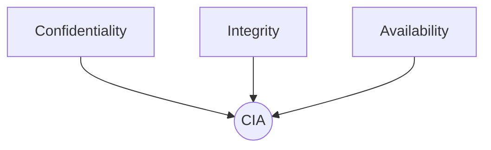
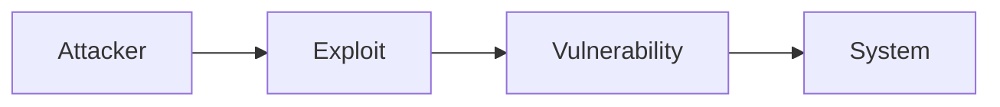
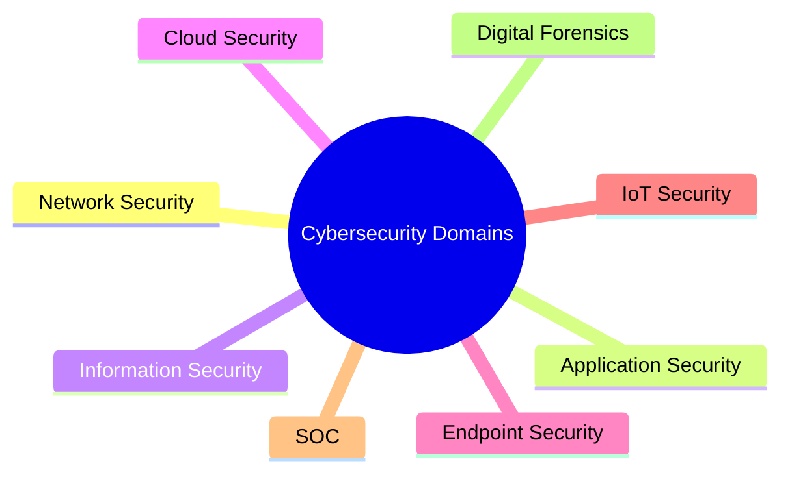
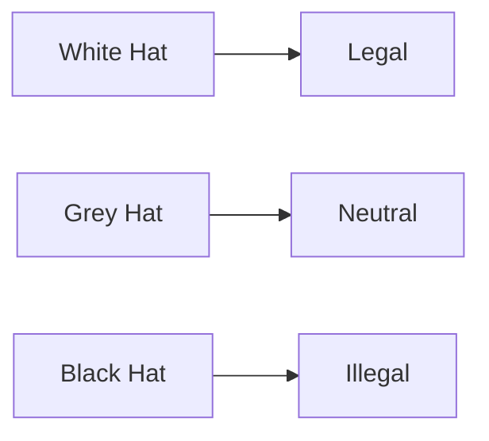
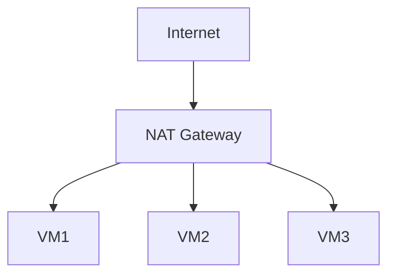
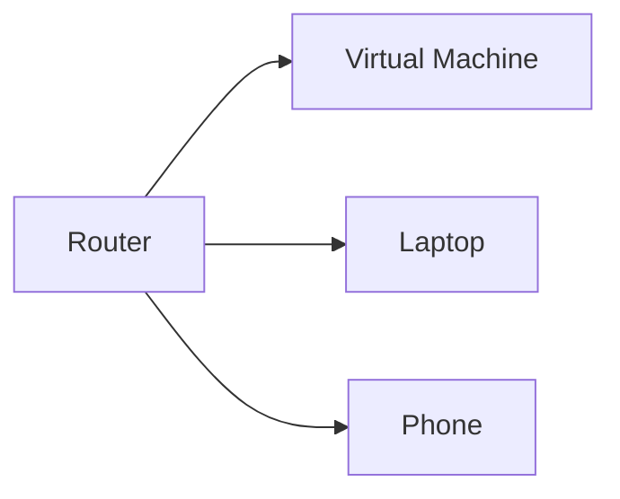
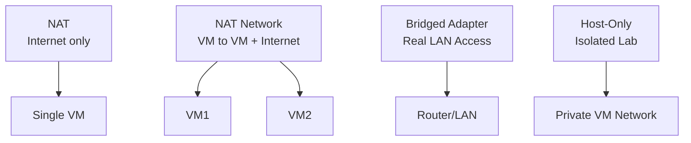
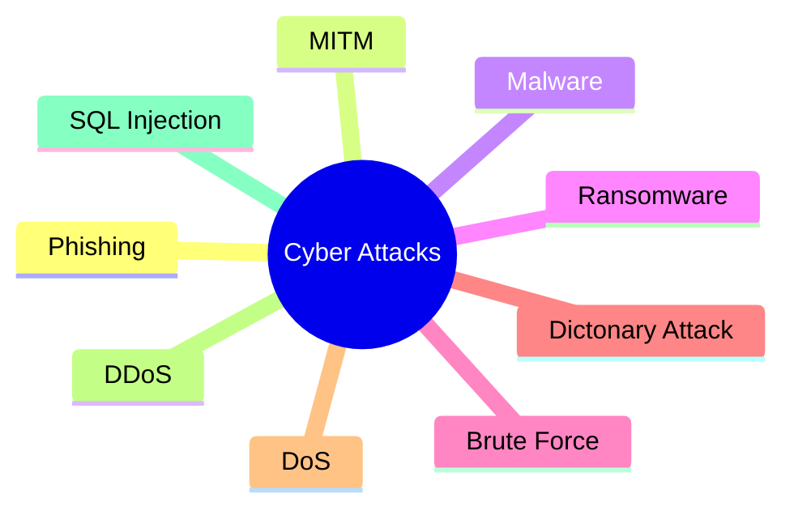

# Week 1 - Cybersecurity Foundations

## Topics Covered
-- What is Cybersecurity?

-- CIA triad

-- Ethical Hacking

-- Types of Hackers

-- Key Terminology

-- VM Networking

-- Common Cyber Attacks

### 🔐 Cybersecurity Basics

-- What is Cybersecurity?

Cybersecurity is the practice of protecting:

* Data (personal, financial, organizational)
* Systems (hardware + software)
* Networks
* Applications
* People

- Simple Memory Trick:

Cybersecurity = Digital Bodyguard for your life

⸻

### 🧱 The CIA Triad (Core Foundation)

* Confidentiality → Only authorized people can access data
* Integrity → Data must not be altered
* Availability → Systems must always be accessible

-- Memory Trick:

CIA = “Protect → Keep Pure → Always Available”

⚠️ If ANY of these break → Security Incident

⸻

### 🌐 Cybersecurity Domains

1. Network Security
2. Application Security
3. Information Security
4. Cloud Security
5. Endpoint Security
6. IoT Security
7. SOC (Security Operations Center)
8. Digital Forensics

-- Memory Trick:

NAIC - EISD

⸻

### 🧑‍💻 Ethical Hacking

Ethical hacking = legal hacking to find weaknesses

* Requires permission
* Same tools as hackers
* Goal = fix vulnerabilities

💡 Rule:

No permission = Crime

⸻

### 🔑 Key Cybersecurity Terminology (A–Z)

⚠️ Core Threat Concepts

* Threat → Potential danger
* Risk → Chance + impact of threat
* Vulnerability → Weakness

-- Formula:

Risk = Threat × Vulnerability

⸻

### 🦠 Malware & Attacks

* Virus → Spreads by attaching to files
* Payload → Actual harmful action
* Exploit → Uses vulnerability

⸻

### 🛡️ Security Tools

* Firewall → Filters traffic
* IDS → Detects attacks
* IPS → Detects + blocks attacks

-- Trick:

IDS = Alarm
IPS = Alarm + Bodyguard

⸻

### 🌍 Networking Basics

* IP Address → Device identity
* Network → Connected systems
* VPN → Secure tunnel
* Proxy → Middleman

⸻

🔐 Access Control

* Authentication → Who are you?
* Authorization → What can you do?

-- Trick:

AuthEN = Entry
AuthOR = Power

⸻

🧠 Advanced Concepts

* Cryptography → Securing data
* Hashing → Fixed output (for integrity)
* Zero-Day → Unknown vulnerability
* CVE → Known vulnerabilities database
* CWE → Known weaknesses

⸻

🎭 Human-Based Attacks

* Social Engineering → Manipulating people
* Phishing → Fake messages to steal data

⸻

🕵️ Other Important Terms

* Keylogger → Records keystrokes
* Botnet → Network of hacked machines
* Spoofing → Fake identity
* Sniffing → Capturing data
* Eavesdropping → Listening secretly
* Insider Threat → Internal risk

### -- (EXTRA NOTE)

📌 IP Address

An IP address is like your home address on the internet.

Used for:

* Sending/receiving data online
* Communication between devices

Example -- 192.168.0.5

📌 MAC Address

A MAC address is the device’s permanent hardware ID.

Used for:

* Identifying the actual device
* Local network communication

Example -- A4:5E:60:AB:12:FF

-- IP Address
“Where is the device?”

-- MAC Address
“What is the device?”

🛡️ EDR Tools

Full Form

EDR = Endpoint Detection and Response

⸻

📌 What is EDR?

EDR tools protect devices like:

* Laptops
* PCs
* Servers
* Phones

They:

* Monitor activity
* Detect threats
* Investigate attacks
* Respond automatically

💡 Think of EDR as:

“Advanced antivirus + security investigator”

⸻

🔍 What EDR Can Detect

* Malware
* Ransomware
* Suspicious processes
* Unauthorized access
* File changes
* Lateral movement inside networks

⸻

⚙️ What EDR Does

1. Detect

Find suspicious behavior.

2. Analyze

Collect logs and attack details.

3. Respond

* Kill malicious process
* Isolate infected device
* Alert security team

⸻

🏢 Popular EDR Tools

* CrowdStrike Falcon
* Microsoft Defender for Endpoint
* SentinelOne
* VMware Carbon Black
* Sophos Intercept X

⸻

📌 Example Scenario

A ransomware file starts encrypting files on a company laptop.

EDR can:

* Detect unusual behavior
* Stop encryption process
* Disconnect device from network
* Alert SOC team

-- SIEM

Monitors and analyzes logs from many systems.

Example Sources:

* Firewalls
* Servers
* Routers
* EDR tools
* Applications

💡 SIEM = Central security dashboard

How They Work Together

Example:

1. EDR detects malware on a laptop
2. EDR sends alert/log to SIEM
3. SIEM correlates it with other suspicious events
4. SOC team investigates

⸻

🧠 Easy Analogy

SIEM - Security command center

EDR - Security guard on each computer

### 🌐 Types of Cybersecurity Domains

Cybersecurity is divided into specialized fields called domains.
Each domain focuses on protecting different parts of digital infrastructure.

⸻

🛜 Network Security

Protects computer networks from attacks and unauthorized access.

Tools & Technologies

* Firewalls
* IDS/IPS
* VPNs
* Network Monitoring

Goal

Protect data traveling through networks.

⸻

💻 Application Security

Focuses on securing software and applications.

Methods

* Secure coding
* Penetration testing
* Code review

Goal

Prevent vulnerabilities in applications.

⸻

📂 Information Security

Protects sensitive information from:

* Unauthorized access
* Modification
* Destruction

Goal

Maintain confidentiality, integrity, and availability of data.

⸻

☁️ Cloud Security

Protects cloud platforms like:

* AWS
* Azure
* Google Cloud

Goal

Secure cloud data, services, and applications.

⸻

🖥️ Endpoint Security

Protects end-user devices such as:

* PCs
* Laptops
* Smartphones

Tools

* Antivirus
* EDR solutions

⸻

📡 IoT Security

Secures Internet of Things devices:

* Smart cameras
* Routers
* Sensors

Problem

IoT devices often have weak security.

⸻

🏢 SOC (Security Operations Center)

A team that monitors and responds to threats 24/7.

Responsibilities

* Threat monitoring
* Incident response
* Log analysis

⸻

🔎 Digital Forensics

Collecting and analyzing digital evidence after cyber incidents.

Used For

* Investigations
* Cybercrime analysis
* Court evidence

-- Ethical Hacking

Ethical hacking is the legal use of hacking techniques to identify vulnerabilities before attackers exploit them.

⸻

📌 Key Points

* Requires permission
* Uses same tools as attackers
* Helps improve security

⸻

🎯 Goals of Ethical Hacking

* Find vulnerabilities
* Prevent attacks
* Improve defenses
* Test security systems

⸻

⚖️ Important Rule

Ethical hacking without permission is illegal.

⸻

### -- Types of Hackers

⚪ White Hat Hacker

* Ethical hacker
* Works legally
* Improves security

Example

Company hires hacker for penetration testing.

⸻

⚫ Black Hat Hacker

* Malicious hacker
* Illegal activities
* Steals data or money

⸻

⚪⚫ Grey Hat Hacker

* Between white & black hat
* May hack without permission
* Usually not harmful

### Types of Networks in VirtualBox

⸻

1️⃣ NAT

* Default mode
* VM gets internet access
* VM hidden behind host

Best For

Basic internet usage.

⸻

2️⃣ NAT Network

* Multiple VMs communicate together
* Internet access available

Best For

Labs with multiple VMs.

⸻

3️⃣ Bridged Adapter

* VM gets real IP address
* Visible on LAN

Best For

Web servers, SSH servers.

⚠️ More exposed to attacks.

⸻

4️⃣ Host-Only Adapter

* Isolated private network
* No internet access

Best For

Cybersecurity labs & malware testing.

⚔️ Common Types of Attacks

⸻

🎣 1. Phishing Attack

Fake emails/messages used to steal:

* Passwords
* Banking details
* Personal information

Types

* Spear Phishing
* Whaling
* Vishing

Prevention

* Verify sender
* Use MFA
* Avoid suspicious links

⸻

🕵️ 2. MITM (Man-in-the-Middle)

Attacker secretly intercepts communication between two parties.

Methods

* Packet sniffing
* Session hijacking

Prevention

* HTTPS
* VPN
* Encryption

⸻

🦠 3. Malware Attack

Malicious software designed to harm systems.

Types

* Virus
* Worm
* Trojan
* Spyware

Prevention

* Antivirus
* Software updates
* Avoid suspicious downloads

⸻

💰 4. Ransomware Attack

Malware that encrypts files and demands payment.

Prevention

* Backups
* Antivirus
* Employee awareness

⸻

🔓 5. Brute Force Attack

Tries every password combination until correct one is found.

Prevention

* Strong passwords
* MFA
* Account lockout

⸻

📖 6. Dictionary Attack

Uses common password lists to crack passwords.

Prevention

* Unique passwords
* Password managers
* MFA

⸻

🚫 7. DoS Attack

Floods server with traffic causing service disruption.

Goal

Make system unavailable.

⸻

🌐 8. DDoS Attack

Distributed DoS using many infected devices (botnet).

Prevention

* DDoS protection
* Traffic filtering
* WAF

⸻

💉 9. SQL Injection

Malicious SQL code inserted into web forms.

Goal

Steal or manipulate database data.

Prevention

* Parameterized queries
* Input sanitization

