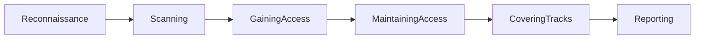

# Ethical Hacking Fundamentals and Kali Linux

## Topics Covered

-- Phases of Ethical Hacking

-- Kali Linux installation

-- Basic Linux Commands 

### Phases of Ethical Hacking

Ethical Hacking follows a structured process used to identify vulnerabilities legally and safely.

### Main Phases

1. Reconnaissance
2. Scanning & Enumeration
3. Gaining Access
4. Maintaining Access
5. Covering Tracks
6. Reporting

### Ethical Hacking Lifecycle

### 1. Reconnaissance

Information gathering phases

Types
- Passive Recon
- Active Recon

Examples
- Google Dorking
- WHOIS lookup
- Port Discovery
- Shodan

### 2. Scanning & Enumeration

Discovering:

- open ports
- services
- OS
- Vulnerabilities

Common Tool
- Nmap

### 3. Gaining Access

Exploiting vulnerabilities to access systems. 

Examples
- Sql Injection
- Weak passwords
- Exploits

### 4. Maintaining Access 

Studying persistence techniques and long term access.

### 5. Covering Tracks

Understanding how attackers hide activity

### 6. Reporting 

Documenting:
- vulnerabilities
- risks
- recommendations
- screenshots/evidence

## Kali Linux

What is Kali Linux?

Kali Linux is a Linux distribution designed for:

- penetration testing
- ethical hacking
- cybersecurity research

It comes with preinstalled with many security tools

### Basic Linux Commands

| Command | Purpose |
|---|---|
| pwd | show current directory |
| ls | list files |
| cd | change directory |
| mkdir | create folder |
| touch | create file |
| clear | clear terminal |
| ifconfig | show network info |
| ip a | display ip address |
| ping | Test Connectivity |
