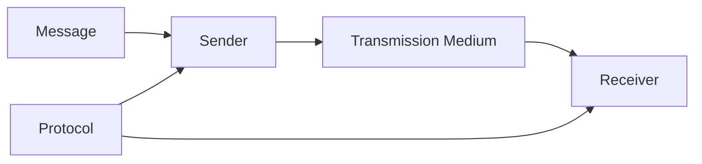
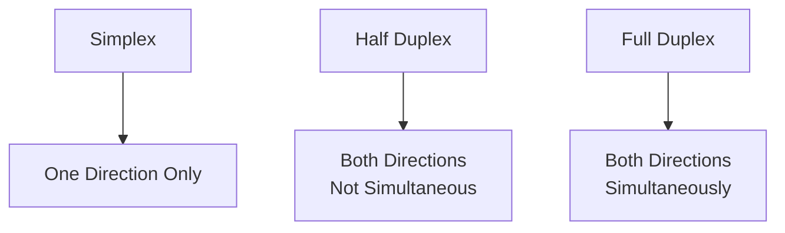
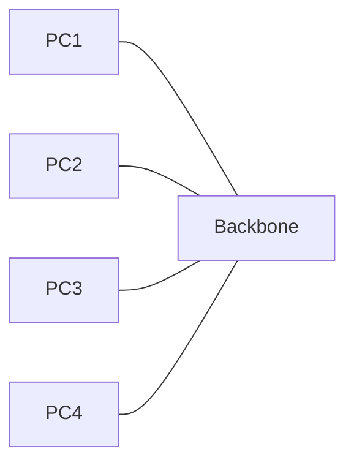
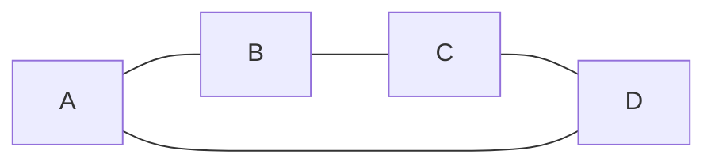
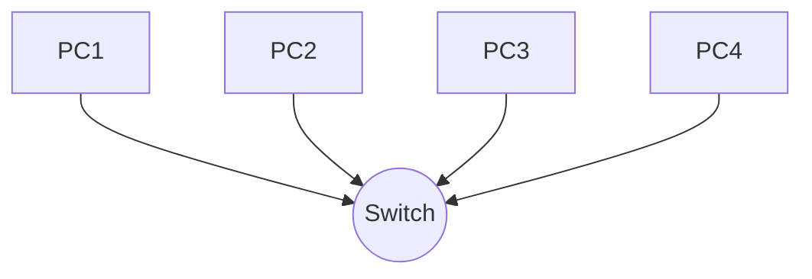
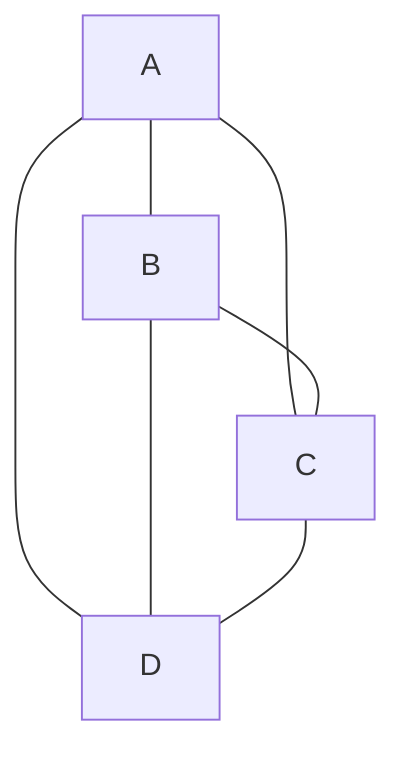
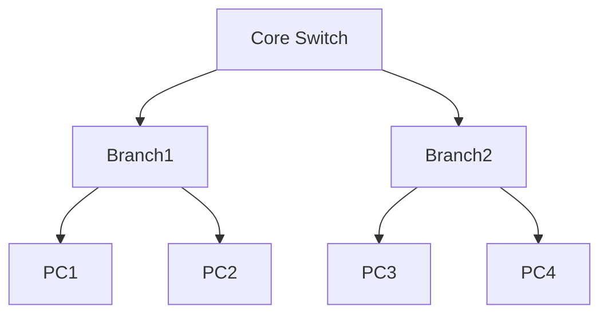
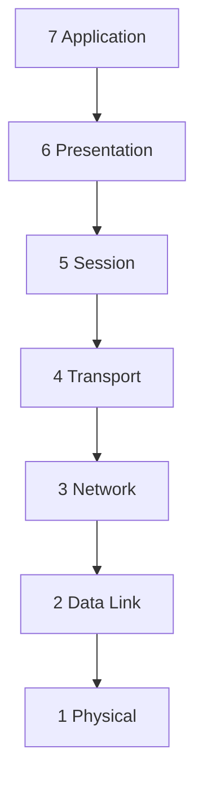
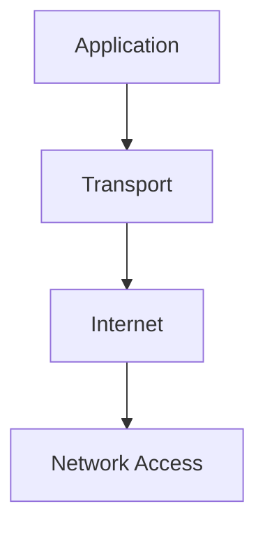
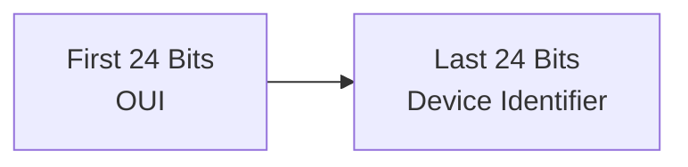

# 🌐 Week 03 - Networking Fundamentals

## Introduction

Networking is one of the most important foundations of cybersecurity. Nearly every cyberattack, security incident, and defensive technology involves network communication in some way.

Understanding how devices communicate helps security professionals:

* Detect attacks
* Analyze traffic
* Configure firewalls
* Investigate incidents
* Secure sensitive data

- **What is a Network?**

A network is a collection of two or more devices connected together so they can communicate and share resources.

Examples:

* Home Wi-Fi
* School computer lab
* Office network
* The Internet

**Simple Formula**

```text
Network = Devices + Connections + Protocols
```
**Components**

1. Devices (Computers, Phones, Servers)
2. Connections (Cable or Wireless)
3. Protocols (Rules for communication)


## Wired vs Wireless Networks

### **Wired Network**

Devices communicate through physical cables.

Common Cable Types

* Ethernet
* Fiber Optic
* Coaxial

Advantages

* Fast
* Stable
* More secure
* Less interference

Disadvantages

* Less mobility
* Higher setup cost


### **Wireless Network**

Devices communicate using radio waves.

Examples

* Wi-Fi
* Bluetooth
* 4G / 5G
* Satellite

Advantages

* Mobility
* Easy deployment

Disadvantages

* More vulnerable
* Signal interference
* Less stable

Why Networking Matters in Cybersecurity

Most cyber attacks occur across networks.

Examples:

* Malware communication
* DDoS attacks
* Phishing websites
* Data exfiltration
* Remote exploitation

**Key Principle**

You cannot defend what you do not understand.


## Types of Networks

### LAN (Local Area Network)

A LAN covers a small geographic area.

Examples:

* Home Wi-Fi
* School Lab
* Office

Characteristics

* High speed
* Easy management
* Easier security

Security Risk

Attackers who gain LAN access can potentially target all connected devices.

### MAN (Metropolitan Area Network)

Connects multiple LANs across a city.

Examples:

* University Campus
* City CCTV System
* Bank Branches

Characteristics

* Medium scale
* Moderate security requirements

Security Risk

Traffic should be encrypted between connected locations.

### WAN (Wide Area Network)

Covers countries or the entire world.

Examples:

* Internet
* Global Enterprise Networks

Characteristics

* Largest network type
* Complex infrastructure

Security Risk

Data travels through many unknown systems.

Always use:

* HTTPS
* VPNs
* Encryption


LAN vs MAN vs WAN

|Feature | LAN | MAN	| WAN |
|---|---|---|---|
|Coverage	| Building | City | World|
|Speed | Fast	| Moderate | Variable|
|Security	| Easier | Moderate	| Hardest|
|Example | Home Wi-Fi | University | Internet|

### Data Communication

Data communication is the transfer of information between devices through a communication medium.

For communication to be effective:

* Accurate
* Timely
* Understandable


### Components of Data Communication



### Components

**Message**

Information being transmitted.

Examples:

* Text
* Images
* Audio
* Video

**Sender**

Device that sends information.

**Receiver**

Device that receives information.

**Transmission Medium**

Path used for communication.

Examples:

* Ethernet Cable
* Fiber Optic
* Wi-Fi

## Protocol

Rules that govern communication.

Examples:

* TCP
* UDP
* HTTP


### Types of Data Communication

**Simplex**

One-way communication.

Examples:

* Television Broadcast
* Keyboard → Computer

**Half-Duplex**

Two-way communication but not simultaneously.

Examples:

* Walkie-Talkie

**Full-Duplex**

Two-way communication simultaneously.

Examples:

* Phone Call
* Video Call



## Network Topologies

Network topology describes how devices are connected and how data flows between them.

**Physical Topology**

Actual physical layout of devices and cables.

**Logical Topology**

How data flows through the network.

## Bus Topology

All devices share one backbone cable.



Advantages

* Cheap
* Easy installation

Disadvantages

* Single cable failure affects entire network
* Low security


## Ring Topology

Devices form a circular path.



Advantages

* No collisions
* Equal access

Disadvantages

* Failure can impact entire network

Important Concept

Token Passing

A token travels around the ring and only the device holding the token can transmit data.


## Star Topology

Most common topology today.



Advantages

* Easy troubleshooting
* High performance
* Easy expansion

Disadvantages

* Switch failure affects entire network


## Mesh Topology

Every device connects directly to every other device.



Advantages

* Extremely reliable
* No single point of failure

Disadvantages

* Expensive
* Difficult to manage

## Hybrid Topology

Combination of multiple topology types.

Examples:

* Universities
* Enterprises
* Large organizations

## Tree Topology

Hierarchical structure.



Advantages

* Scalable
* Organized

Disadvantages

* Root device becomes critical


## OSI Model

OSI stands for Open Systems Interconnection.

It explains network communication using seven logical layers.



**Mnemonic**

All People Seem To Need Data Processing


## OSI Layers

### **Layer 7 - Application**

User-facing services.

Protocols:

* HTTP
* FTP
* DNS
* SMTP


### **Layer 6 - Presentation**

Responsible for:

* Encryption
* Compression
* Formatting

Example:

* SSL/TLS

### **Layer 5 - Session**

Manages communication sessions.

Example:

* Login sessions

### Layer 4 - Transport

Responsible for reliable delivery.

Protocols:

* TCP
* UDP

Functions:

* Segmentation
* Reassembly
* Port Numbers

### Layer 3 - Network

Responsible for routing.

Uses:

* IPv4
* IPv6

Device:

* Router

### Layer 2 - Data Link

Responsible for communication within a LAN.

Uses:

* MAC Addresses

Device:

* Switch

### Layer 1 - Physical

Actual transmission of bits.

Examples:

* Ethernet
* Fiber
* Wireless Signals

## TCP/IP Model

The practical model used by the Internet.



### OSI vs TCP/IP

|OSI|	TCP/IP|
|---|---|
|7 Layers | 4 Layers|
|Theoretical | Practical|
|Used for learning	| Used on Internet|


### Layer Mapping

|OSI Layer	| TCP/IP Layer|
|---|---|
|Application |	Application|
|Presentation	| Application|
|Session	| Application|
|Transport	| Transport|
|Network	| Internet|
|Data Link	| Network Access|
|Physical	| Network Access|

## IPv4

Internet Protocol Version 4.

Used to identify devices on a network.

Example:

```text
192.168.1.1
```

Structure

* 32 bits
* 4 octets
* Each octet ranges from 0-255


### Address Types

**Unicast**

One-to-one communication.

**Broadcast**

One-to-all communication.

**Multicast**

One-to-many communication.

### IPv4 Classes and Ranges

|Class | First Octet Range | IP Range	| Default Mask	| CIDR	| Hosts per Network	| Common Use|
|---|---|---|---|---|---|---|
|A	| 1 - 126 |	1.0.0.0 - 126.255.255.255 | 255.0.0.0	| /8	| 16,777,214	| Very large organizations, ISPs|
|B	| 128 - 191 |	128.0.0.0 - 191.255.255.255 |	255.255.0.0	| /16	| 65,534	| Universities, large companies|
|C	| 192 - 223 |	192.0.0.0 - 223.255.255.255 | 255.255.255.0	| /24	| 254	| Homes, small businesses, offices|
|D	| 224 - 239 | 224.0.0.0 - 239.255.255.255	| N/A	| N/A	| N/A	| Multicast traffic|
|E	| 240 - 255	| 240.0.0.0 - 255.255.255.255	| N/A	| N/A	| N/A	| Experimental and research|

## IPv6

Designed to replace IPv4.

Example:

```texr
2001:db8::1
```

Characteristics

* 128-bit address
* Hexadecimal format
* Vast address space


### Address Types

**Unicast**

One sender → One receiver

**Multicast**

One sender → Many receivers

**Anycast**

One sender → Nearest receiver


IPv4 vs IPv6

|Feature|	IPv4|	IPv6|
|---|---|---|
|Bits	| 32	| 128|
|Format	| Decimal |	Hexadecimal|
|Broadcast | Yes | No|
|Security |	Optional|	IPsec Built-In|
|Configuration| DHCP | SLAAC|


## MAC Address

Media Access Control Address.

Unique identifier assigned to a Network Interface Card (NIC).

Example:

```text
00:1A:2B:3C:4D:5E
```

MAC Address Structure



## OUI

Organizationally Unique Identifier.

Assigned by IEEE.

Identifies the manufacturer.

## Device Identifier

Assigned by manufacturer.

Identifies the specific device.


### Key Cybersecurity Takeaways

* Networking is the foundation of cybersecurity.
* OSI helps identify where attacks occur.
* Layer 2 attacks include ARP Spoofing.
* Layer 4 attacks include DDoS attacks.
* Layer 7 attacks include phishing and web attacks.
* IP addresses identify devices logically.
* MAC addresses identify devices physically.
* Understanding networking is essential for SOC analysts, penetration testers, and security engineers.
