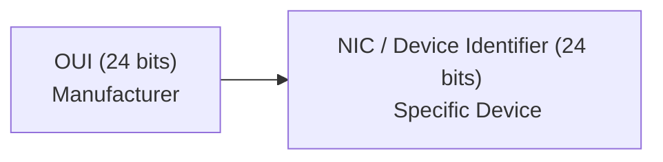

## ARP (Address Resolution Protocol)

ARP is used to find the MAC address of a device when you already know its IP address

- **Why ARP exists?**

Computers communicate on a LAN using MAC addressess, but humans (users) and applications usually know IP addressess.

Example:

```text
IP Address: 192.168.1.10

MAC Address: 00:1A:2B:3C:4D:5E
```

If you computer wants to send data to 192.168.1.10, it first needs to discover the MAC address.

### How ARP works


### Cybersecurity Relevance

Attackers can perform ARP Spoofing (ARP Poisoning) by sending fake ARP replies and pretending to be another device.

This can allow: 

* MITM attacks
* Traffic interception
* Credential Theft

- OSI Layer: Layer 2 (data link)

## VLSM (Variable Length Subnet Mask)

VLSM allows a network administrator to crete subnets of different sizes from the same network.

- **Why VLSM exists**

Without VLSM, IP addresses can be wasted.

Example:

Suppose a company has:

* HR department -> 20 devices
* IT department -> 100 devices
* Management -> 10 devices

Giving every department the same subnet wastes many IP addresses.

With VLSM

```text
IT -> /25
HR -> /27
Management -> /28
```

Each department receives only the number of addresses it needs.

Benefits 

* Better IP utilization
* Less waste
* Easier network design
* Improved scalability

### Cybersecurity Relevance 

Security teams often use subnetting and VLSM to:

* Segement departments
* Reduce attack surfaces
* Isolate sensitive systems

Example:

```text
Finance VLAN
HR VLAN
Guest WiFi VLAN
Server VLAN
```

If an attacker compromises Guest Wifi, they should not automatically reach Finance systems.

## Common CIDR / Subnet Mask Reference Table

| CIDR | Subnet Mask | Total IPs | Usable Hosts | Typical Use |
|--------|---------------|------------|--------------|-------------|
| /30 | 255.255.255.252 | 4 | 2 | Router-to-Router Links |
| /29 | 255.255.255.248 | 8 | 6 | Network Devices |
| /28 | 255.255.255.240 | 16 | 14 | Small Teams / Management |
| /27 | 255.255.255.224 | 32 | 30 | Small Departments |
| /26 | 255.255.255.192 | 64 | 62 | Medium Departments |
| /25 | 255.255.255.128 | 128 | 126 | Large Departments |
| /24 | 255.255.255.0 | 256 | 254 | Small Office / LAN |
| /23 | 255.255.254.0 | 512 | 510 | Large Office |
| /22 | 255.255.252.0 | 1024 | 1022 | Large Campus |
| /16 | 255.255.0.0 | 65,536 | 65,534 | Very Large Enterprise |
| /8 | 255.0.0.0 | 16,777,216 | 16,777,214 | Internet-Scale Networks |

### Key Pattern

As the CIDR number increases:

- Network size becomes smaller
- Number of usable hosts decreases
- IP address usage becomes more efficient

### Most Common Values

| CIDR | Usable Hosts |
|--------|--------------|
| /24 | 254 |
| /25 | 126 |
| /26 | 62 |
| /27 | 30 |
| /28 | 14 |
| /29 | 6 |
| /30 | 2 |

### Easy Memory Trick

```text
/24 = 254 hosts
/25 = 126 hosts
/26 = 62 hosts
/27 = 30 hosts
/28 = 14 hosts
/29 = 6 hosts
/30 = 2 hosts
```

## OUI vs NIC

This topic comes from MAC addresses

Remember:

```text
MAC Address: 00:1A:2B:3C:4D:5E
```

A MAC address is 48 bits long 

## OUI (Organizationally Unique Identifier)

The first 24 bits of the MAC address.

Example:

```text
00:1A:2B
```

Assigned by the IEEE

It identifies the manufacturer

Example:

* Cisco
* Dell
* HP
* Apple

When you see the OUI, you can often determine who made the device.

## NIC (Device Identifier) - Network Interface Card

The last 24 bits of the MAC address.

Example: 

```text
3C:4D:5E
```

Assigned by the manufacturer

This uniquely identifies the specific device.

### OUI vs NIC Diagram


